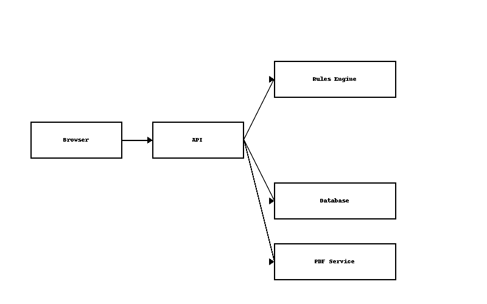

# 🌍 Global Contractor Risk Checker (GCRC) — Product & Documentation Hub

**Author:** Abhishek Dhama  
**Contact:** abhishekkdhama@gmail.com  
**Live Demo:** [https://stock-sage-abhishekdhama18.replit.app/](https://stock-sage-abhishekdhama18.replit.app/)  

---

## 🚀 What Is This?

A **working SaaS prototype** + **complete product documentation suite** for a **global contractor risk and compliance engine**—tailored for Deel’s core markets.  
This project enables instant, auditable risk assessments of contractors worldwide and streamlines compliance for hiring at scale.

**In 60 seconds:**  
- Run a contractor risk check for any country  
- See transparent scoring and risk factors  
- Export a branded PDF for compliance/legal  
- Manage rules in an admin view without engineers

---

## 👀 Quick Demo Actions

1. Search any country → run a contractor risk assessment → get live scoring, risk factors, and recommendations  
2. Download an instant, branded PDF report for any risk assessment  
3. Access admin (rules, analytics, settings) for compliance ops view

*(Hosted on Replit for zero-friction access. In production, this would be deployed to Deel’s secure infrastructure and integrated with internal services.)*

---

## 📸 Screenshots

| Home | Risk Result | PDF Export |
|------|-------------|------------|
|  |  |  |

---

## 📁 Key Artifacts

- **Live App:** [https://stock-sage-abhishekdhama18.replit.app/](https://stock-sage-abhishekdhama18.replit.app/)
- **Product Requirements (PRD):** [docs/PRD.md](docs/PRD.md)
- **Functional Spec (FSD):** [docs/FSD.md](docs/FSD.md)
- **Technical Spec (TSD):** [docs/TSD.md](docs/TSD.md)
- **Wireframes/UI/UX:** [docs/High-Fidelity%20Wireframes%20and%20Clickable%20Mockups.md](docs/High-Fidelity%20Wireframes%20and%20Clickable%20Mockups.md)
- **Analytics Plan:** [docs/Analytics%20%26%20Metrics.md](docs/Analytics%20%26%20Metrics.md)
- **User Stories & Acceptance Criteria:** [docs/User%20Stories%20%26%20Acceptance%20Criteria.md](docs/User%20Stories%20%26%20Acceptance%20Criteria.md)
- **Delivery Roadmap:** [docs/Roadmap%20and%20Sprints.md](docs/Roadmap%20and%20Sprints.md)
- **Risk Register:** [docs/Risk%20Register.md](docs/Risk%20Register.md)
- **UI/UX Guide:** [docs/UI%3AUX%20Design%20Document.md](docs/UI%3AUX%20Design%20Document.md)
- **License:** [docs/License.md](docs/License.md)

---

## 🛠 Architecture

**Flow:** Browser → API → Rules Engine → Database → PDF Service  
- **Frontend:** TypeScript + React + Tailwind (Vite)  
- **Backend:** Node.js/Express + Drizzle ORM + SQLite (Replit-hosted)  
- **PDF Generation:** Server-side PDFKit  

---

## 🧪 Known Gaps

Manual QA is tracked in `verification_artifacts.md`.  
For full production readiness:  
- Implement automated tests (unit/integration) for scoring engine + endpoints  
- Add `/tests` directory with Jest test cases for rules and PDF generation  
- Integrate security scanning and CI pipeline

---

## 🏆 Why Share This?

- Demonstrates the ability to **conceptualize, build, and deliver** a globally-relevant SaaS product—solo, end-to-end  
- Shows **PM leadership** in vision, prioritization, risk management, analytics, and documentation  
- **Founder-ready** for review, feedback, and MVP pilot discussion

---

## 🗓 If I joined Deel tomorrow – 30/60/90 Plan

**First 30 days:**  
- Integrate real jurisdictional compliance data via Deel’s internal APIs  
- Validate scoring logic with compliance/legal teams

**Next 30 days:**  
- Ship role-based access for managers, compliance, and admins  
- Add version history + audit logs for rule changes

**Next 30 days:**  
- A/B test report formats for clarity and decision speed  
- Expand to include cost/time impact projections per country

---

## 💬 Let’s Talk

Curious to learn what Deel’s founders, product, or compliance teams would add, improve, or prioritize.  
📧 **Email:** abhishekkdhama@gmail.com  

---

*(Last updated: August 2025)*
